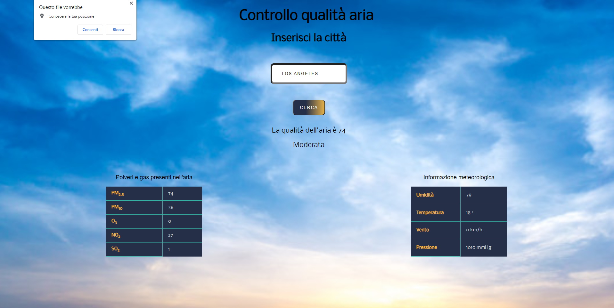

# Progetto-JavaScript-Advanced-di-Felice-Bocchini

## Costruito con
* HTML
* CSS
* Javascript

## Spiegazione

Questa è un'app che vi tiene aggiornati sulla qualità dell'aria.
L'app prevede un'alert per la geolocalizzazione. Al consenso dell'utente apparirà una mini-mappa
che mostrerà la sua posizione. L'utente potrà inserire nell'apposita casella di input la città da cercare
 e successivamente cliccare sul pulsante "cerca" per ottenere le informazioni.
 Ci sono tabelle che indicano le quantità di polveri e gas presenti nell'aria e alcune informazioni meteorologiche.
## Contatti

Felice Bocchini - [Instagram](https://www.instagram.com/felixkou07/) - felice.bocchini@gmail.com

Link al progetto: https://github.com/Felice-Bocchini/Progetto-JavaScript-Advanced-di-Felice-Bocchini

Link all'app: https://javascript-advanced.web.app/
